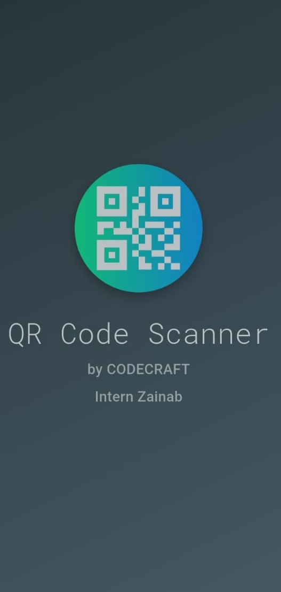
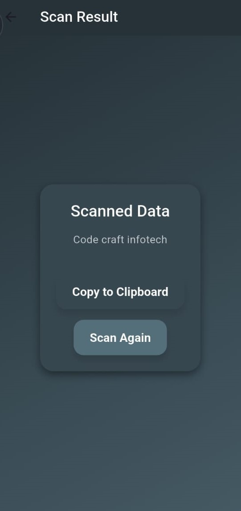
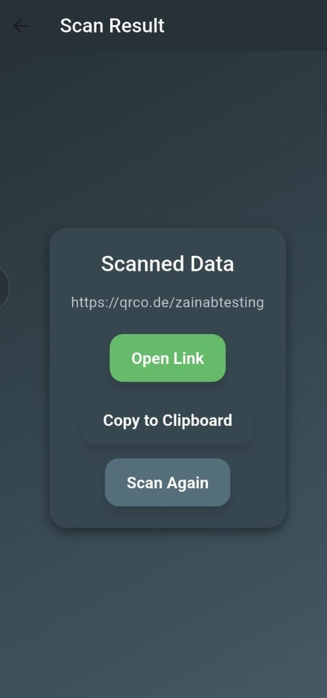
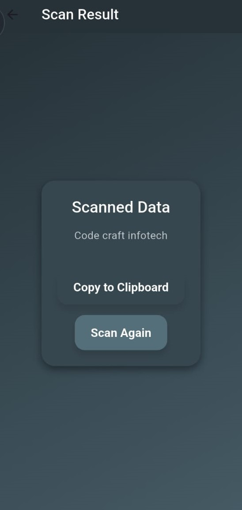

# 📱 QR Code Scanner App — CodeCraft Internship Task #5

This Flutter app was built as **Task 5** during my internship at **CodeCraft**. It features a modern **QR Code Scanner** with:

* 🔍 Real-time scanning using the device camera
* 💾 SQLite database integration (via `sqflite`) to store scanned results
* 🌐 Link detection and redirection using `url_launcher`
* 🧠 Smart result handling (copy, open URL, or view data)
* 🎨 Splash screen, smooth UI, and modern styling

---

## 🚀 Features

* **Splash Screen** with animations and branding
* **Mobile QR Code Scanning** using `mobile_scanner`
* **Result Screen** to display, copy, or open scanned content
* **SQLite Integration** via custom `dbhelper.dart` for storing history
* **URL Detection** with one-tap redirect to browser
* **Custom Styling**: Gradients, shadows, modern fonts (`Roboto` / `RobotoMono`)

---

## 🧰 Technologies & Packages

| Package          | Purpose                                   |
| ---------------- | ----------------------------------------- |
| `flutter`        | Cross-platform UI framework               |
| `mobile_scanner` | Real-time camera and QR scanning          |
| `sqflite`        | Store scan data locally using SQLite      |
| `path_provider`  | Database path management (via `dbhelper`) |

---

## 📂 Project Structure

```txt
assets/
├── fonts/
│   └── [font files]
├── images/
│   └── logo.png
├── screenshots/
│   └── s1.jpeg
│   └── s2.jpeg
│   └── s3.jpeg
│   └── s4.jpeg

lib/
├── main.dart
├── dbhelper.dart
```

---

## 📸 Screenshots

Below are concise cropped screenshots showcasing the main screens and functionality of the QR Code Scanner app:

| Splash Screen                   | Scanner View                    | Result Screen (URL)             |
| ------------------------------- | ------------------------------- | ------------------------------- |
|  |  |  |

| Result Screen (Plain Text)      |
| ------------------------------- |
|  |

---

## ✅ How It Works

1. Splash screen loads with animation
2. Camera opens automatically with a scanning window
3. When a QR code is detected:

   * Data is stored in the local database
   * Navigates to the Result Screen
4. Result Screen options:

   * 📋 Copy data to clipboard
   * 🌐 Open in browser (if it's a valid URL)
   * 🔁 Scan again

---

## 🧑‍💻 Made by

* **Zainab** — Flutter Intern at **CodeCraft**
